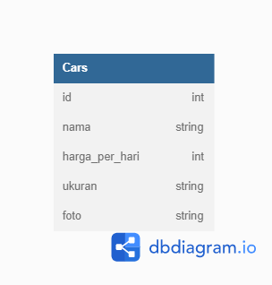

# BCR - Car Management Dashboard

Ini adalah tugas untuk memenuhi challenge 5 dalam bootcamp Binar dengan desai figma sebagai barikut [desain dari figma](<https://www.figma.com/file/BauisL5XNnbfGxqvvq6Bh9/BCR---Car-Management-Dashboard-(Copy)?node-id=18343%3A5831>).

# Frontend Server

## Setup Server

    cd frond-end
    npm install

`npm install` diperlukan untuk menginstall semua dependencies yang diperlukan dalam project.

## Running Server

    cd frod-tend
    npm start

Server frontend secara default akan berjalan di `http://localhost:8000/`  
Port server bisa diganti di dalam file `frond-end/index.js`

## Server Routing

| Page     | Route            | Default Route                       |
| -------- | ---------------- | ----------------------------------- |
| Homepage | `/`              | http://localhost:8000/              |
| Add Car  | `/add-car`       | http://localhost:8000/add-car       |
| Edit Car | `/update-car?id` | http://localhost:8000/update-car?id |

# Backend Server

## Setup Server

    cd back-end
    npm install

`npm install` diperlukan untuk menginstall semua dependencies yang diperlukan dalam project.

Setelah itu pastikan [PostgreSQL](https://www.postgresql.org/download/) sudah ter-install dan berjalan di komputer. Kemudian setup file `back-end/config/config.json` sesuai dengan settings database PostgreSQL yang sedang berjalan. Lanjut jalankan perintah berikut di terminal.

    cd backend/
    sequelize db:create
    sequelize db:migrate

## Running Server

    cd backend
    nodemon index.js

Server frontend secara default akan berjalan di `http://localhost:9000/`  
Port server bisa diganti di dalam file `back-end/index.js`

## REST API Endpoints

#### _HTTP Request_

> **GET**

#### _Default Request URL_

    http://localhost:9000/cars

#### _Expected Response_

Response Code: `200`  
Response Body:

    {
    	"data": [
    		{
    			"id": number,
    			"nama": string,
    			"harga_per_hari": number,
    			"ukuran": string,
    			"foto": string,
    			"createdAt": timestamp,
    			"updatedAt": timestamp
    		}
    	]
    }

---

### Get Car with ID

Mengembalikan data car berdasarkan dengan ID dari database.

#### _HTTP Request_

> **GET**  
> `cars/:id`

#### _Default Request URL_

    http://localhost:9000/cars/:id

#### _Expected Response_

Response Code: `200`  
Response Body:

    {

    	"data": {
    		"nama": string,
    		"ukuran": string,
    		"sewa_per_hari": number,
    		"foto": string,
            }
    }

---

### Add New Car

Menambahkan data mobil baru ke database.

#### _HTTP Request_

> **POST**  
> `/cars`

#### _Default Request URL_

    http://localhost:9000/cars

#### _Expected Request_

Response Code: `200`  
Request Body:

    {
    		"nama": string,
    		"ukuran": string,
    		"sewa_per_hari": number,
    		"foto": string,
    }

---

### Edit Car Data with ID

Mengedit data car berdasarkan ID nya di database.

#### _HTTP Request_

> **PUT**  
> `/cars/:id`

#### _Default Request URL_

    http://localhost:9000/cars/:id

#### _Expected Request_

Request Body:

    {
    		"id": number,
    		"nama": string,
    		"ukuran": string,
    		"sewa_per_hari": number,
    		"foto": string,
    }

### Delete Car with ID

Menghapus data car berdasarkan dengan ID dari database.

#### _HTTP Request_

> **DELETE**  
> `/cars/:id`

#### _Default Request URL_

    http://localhost:9000/cars/:id

#### _Expected Response_

Response Code: `200`  
Response Type: `application/json`  
Response Body:

    {
        "status": "success",
        "message": "Delete data with id={carId} successfully"
    }

---

# Database Design

Database proyek ini hanya menggunakan satu tabel saja karena kompleksitas data yang dibutuhkan sangat simpel. Berikut diagram yang mempresentasikan model data yang digunakan dalam aplikasi ini:

